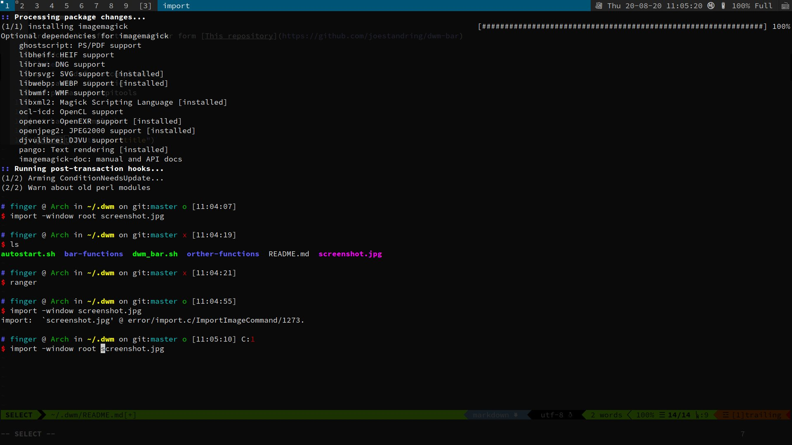

# my dwm script 

Script in `bar-functions` folder form [This repository](https://github.com/joestandring/dwm-bar)

Dependency:
```shell
yay -S nerd-fonts-complete
sudo pacman -S pamxier
sudo pacman -S acpitools
```

just have a simple bar


